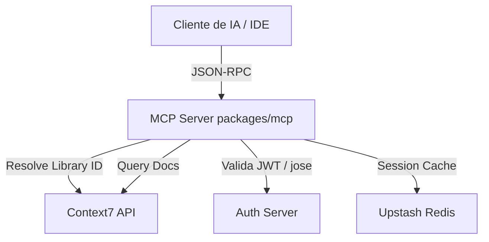

# Arquitetura do Repositório - Context7

Este documento descreve a organização técnica e o fluxo de dados dentro do monorepo **Context7**.

## Estrutura do Monorepo

O projeto está estruturado utilizando `pnpm workspaces` com os seguintes pacotes localizados no diretório `packages/`:

- **`cli`**: Roda o CLI do Context7 para desenvolvedores consumirem e gerenciarem documentação localmente ou via terminal.
- **`mcp`**: Servidor Model Context Protocol principal que expõe ferramentas de resolução e busca de documentação de bibliotecas para modelos de linguagem. Suporta transporte HTTP e Stdio.
- **`sdk`**: SDK do cliente para consumir a API do Context7 programaticamente.
- **`tools-ai-sdk`**: Ferramentas e utilitários integrados com a SDK de IA da Vercel (`vercel-ai-sdk`).

## Fluxo de Execução do Servidor MCP

1. O cliente (ex: IDE ou wrapper MCP) conecta ao servidor MCP via **Stdio** ou **HTTP/SSE**.
2. Para consultas HTTP, as sessões são criadas no Redis e o ID é retornado no header `mcp-session-id`.
3. Validação de JWT é efetuada no middleware utilizando a biblioteca `jose` para rotas autenticadas (`/mcp/oauth`).
4. Chamadas às ferramentas (`resolve-library-id` e `query-docs`) batem na API de produção do Context7 e formatam os dados.
